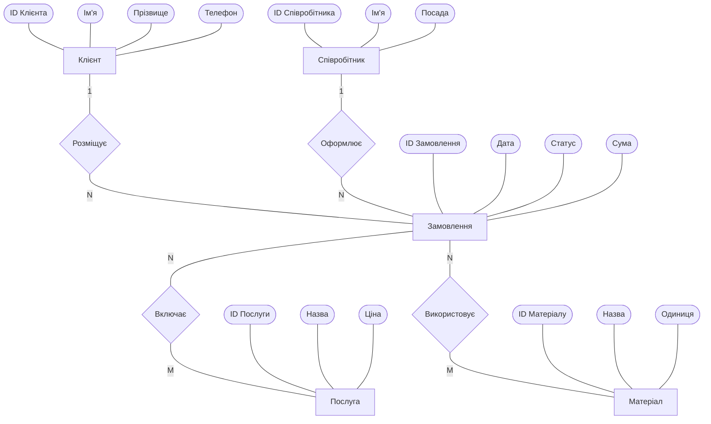
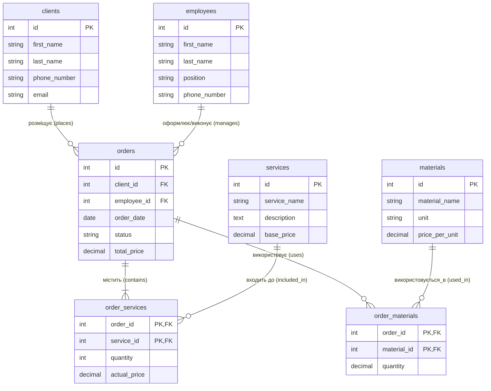

# Схеми Бази Даних Ательє

## 1. Концептуальна схема (Нотація Пітера Чена)

Нижче наведена концептуальна модель бази даних у нотації Пітера Чена, реалізована через Mermaid (прямокутники — сутності, ромби — зв'язки, овали — атрибути).

## 2. Логічна схема (Нотація Crow's Foot)

Нижче наведена логічна модель, що відображає таблиці в реляційній базі даних (включаючи проміжні таблиці для зв'язків багато-до-багатьох) у нотації Crow's Foot.

